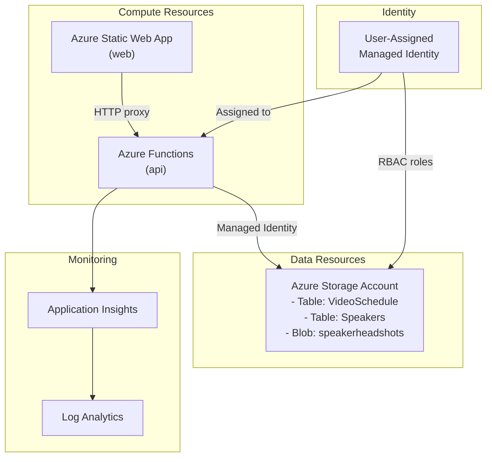

# Azure Deployment Plan for Azure Core Underground

## Goal
Deploy the Azure Core Underground event website with a Static Web App frontend, Function App backend, and Azure Storage for data persistence.

## Project Information

**Web Frontend (web)**
- **Technology Stack**: HTML/CSS/JavaScript Static Web Application
- **Application Type**: Event schedule and speaker showcase website
- **Files**: index.html, admin.html, schedule-admin.html, speakers-admin.html, styles.css
- **Hosting**: Azure Static Web App (Standard tier)

**API Backend (api)**
- **Technology Stack**: Node.js 20.x Azure Functions v4
- **Application Type**: REST API for schedule and speaker management
- **Files**: api/src/functions/schedule.js, speakers.js
- **Hosting**: Azure Functions (Elastic Premium EP1)
- **Authentication**: Managed Identity (no shared keys)

## Azure Resources Architecture

> **Install the Mermaid Preview extension in VS Code to view the diagram.**



## Data Flow

1. Users access the Static Web App frontend
2. SWA proxies API requests to the linked Function App backend
3. Function App authenticates to Storage using User-Assigned Managed Identity
4. Schedule and speaker data stored in Azure Table Storage
5. Speaker headshots served from Blob Storage (public blob access)
6. Logs and metrics flow to Application Insights and Log Analytics

## Recommended Azure Resources

### Application: web (Static Web App)
- **Hosting Service**: Azure Static Web Apps
- **SKU**: Standard (supports custom domains, staging environments)
- **Configuration**:
  - Language: JavaScript
  - Build: No build required (static files)

### Application: api (Function App)
- **Hosting Service**: Azure Functions
- **SKU**: EP1 (Elastic Premium - supports managed identity storage)
- **Configuration**:
  - Language: Node.js 20.x
  - Runtime: ~4
  - Environment Variables:
    - `AZURE_STORAGE_ACCOUNT` - Storage account name
    - `AZURE_CLIENT_ID` - Managed identity client ID
    - `APPLICATIONINSIGHTS_CONNECTION_STRING` - App Insights

### Dependencies

| Resource | SKU | Service Type | Connection Type |
|----------|-----|--------------|-----------------|
| Storage Account | Standard_LRS | Azure Storage | Managed Identity |
| Application Insights | - | App Insights | Connection String |
| Log Analytics | PerGB2018 | Log Analytics | - |

### Security Configuration

- **User-Assigned Managed Identity**: Assigned to Function App
- **RBAC Role Assignments**:
  - Storage Blob Data Owner
  - Storage Blob Data Contributor
  - Storage Queue Data Contributor
  - Storage Table Data Contributor
  - Storage Account Contributor
  - Monitoring Metrics Publisher
- **Storage Account**: Shared key access disabled
- **Blob Container**: `speakerheadshots` with public blob access for images

## Execution Steps

### 1. Initialize azd environment
```bash
azd init
```

### 2. Provision infrastructure and deploy
```bash
azd up
```

### 3. Verify deployment
- Check Static Web App URL in outputs
- Verify API endpoints respond
- Check Application Insights for logs

## Files Created

| File | Description |
|------|-------------|
| `azure.yaml` | AZD project definition with services and hooks |
| `infra/main.bicep` | Main infrastructure template (subscription scope) |
| `infra/resources.bicep` | All Azure resources (resource group scope) |
| `infra/main.parameters.json` | Parameter values for deployment |
